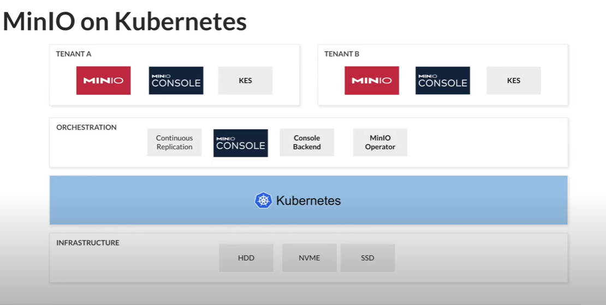

<h1 align="center">MinIO Operator</h1>

### Overview:

MinIO is an open source, enterprise-grade, high performance Amazon S3 compatible object storage server, designed for large-scale private cloud infrastructure. MinIO is designed in a cloud-native manner to scale sustainably in multi-tenant environments. 
MinIO-Operator brings native MinIO, MCS and KES support to Kubernetes with some key features including: 

- SQL Select
- Encryption & WORM
- Multi-Site Federation
- Lambda Compute
- Integration with IAM Tools
- Erasure Code & Bitrot Protection

Orchestration platforms like Kubernetes provide a perfect launchpad for MinIO to scale.

### Features of MinIO Operator

a.	**Deploy:** Launch MinIO Clusters with specific affinity, toleration and other pre-defined settings.

b. **Configure:** Configure the fundamentals of MinIO like versions, persistence, erasure code configuration and replicas.

c. **Automatic TLS:** Deploy TLS enabled MinIO clusters with built-in certificate signing requests.

### Architecture
MinIO is designed for large-scale private cloud infrastructure and can be scaled sustainably in multi-tenant environments. 

The following diagram describes the architecture of a MinIO deployed into Kubernetes:

### Objective of tutorial

In this tutorial,we are going to cover following topics:

1. Install MinIO Operator and verify its successful installation.
2. Create MinIO Instance and verify the status of pods and services.
3. Access MinIO Console and create storage bucket and upload files.
4. Connect to the pods and access files stored inside storage bucket.
5. Clean-up Operator resources.

